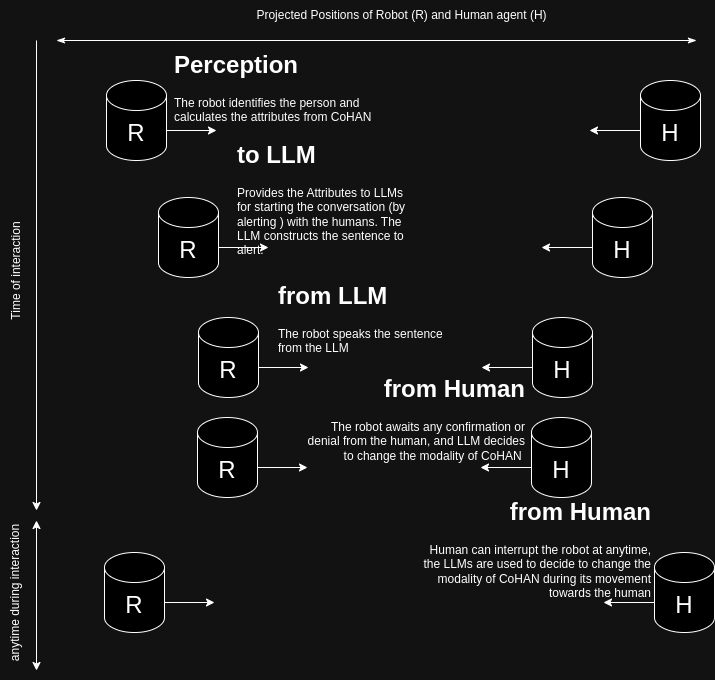

# CoHAN ATTR (attribute)

## The package consists of initial developement towards creating explainable features from human aware motion planning frameworks

## Installation
```
$ 
$ git clone https://github.com/hariharan20/cohan_attr
$ cd cohan_attr
$ cd custom_dockers
$ ./build_docker.sh #For first building of docker image
$ ./run_docker.sh 


```
## Execution
Once inside the docker image : (default working directory : catkin_ws)
```
$ catkin build
$ rosrun cohan_attr attr.py
```
For now, the script prints out the statements (TO BE converted to ROS messages

)

## List of Attributes extracted from COHAN :

* The Point of the closest encounter (PE) of the robot and the human (nearest to the robot) 
* The Distance between the robot and the human during their closest encounter
* The time for the robot taken to the reach PE
* The Direction of crossing of the robot from during their encounter

## Ideas for using the attributes

These attributes represent the future states of the robot and the human (agent) in the scene. The initial idea is to exploit these information for 
starting the conversation (by alerting) the human about their possible encounter.

* The conversation is intented to continue during the interaction with the human and to also help the robot control its modalities for a smoother interaction

## Idea Image : 

The image shows the initial proposal use-case for introducing LLMs for navigation in human robot interaction 

